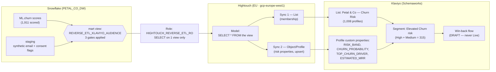

# Reverse ETL — Snowflake → Klaviyo (Churn-Risk Activation)

**Demo project · Petal & Co · Schema Works**

Pushes per-customer churn-risk scores from a Snowflake warehouse into Klaviyo via Hightouch,
so an at-risk audience and a win-back flow stay continuously in sync with the model — **consent-gated
and GDPR-aware end to end**. Built entirely on synthetic, non-deliverable data.

---

## What this demonstrates

- **Reverse ETL / data activation** — warehouse is the source of truth; the marketing tool is a downstream sync target.
- **Consent and erasure enforced at the source**, not bolted on at the destination.
- **Least-privilege access** — the sync tool sees exactly one view, read-only.
- **Safe-by-construction demo** — four independent guarantees that nothing can ever reach a real inbox.

---

## Data flow



---

## The three gates

The audience view materialises only rows passing **all three**:

| Gate | Condition | Purpose |
|------|-----------|---------|
| Consent | `MARKETING_CONSENT = TRUE` | Only marketing-consented customers leave the warehouse |
| Erasure | `IS_ERASED = FALSE` | Right-to-erasure honoured at source — erased customers never sync |
| Active | `IS_CHURNED = FALSE` | Target active-but-at-risk customers, not already-churned |

**Result:** 1,911 scored → **1,008** synced. Verified: row count matched at every stage
(Snowflake view, Hightouch run, Klaviyo list).

Risk distribution (gated population):

| Band | Profiles | MRR at risk |
|------|----------|-------------|
| Low | 693 | £3,844.50 |
| Medium | 312 | £3,363.43 |
| High | 3 | £26.27 |

The win-back audience (High + Medium) = **315 profiles, ~£3,390 MRR**.

---

## GDPR control mapping

| GDPR principle | How it's enforced here |
|----------------|------------------------|
| Lawfulness / consent | `MARKETING_CONSENT` gate; nothing non-consented leaves the warehouse |
| Right to erasure | `IS_ERASED` gate; "remove on exit" propagates erasure to Klaviyo automatically |
| Data minimisation | Only 5 fields leave the warehouse; no raw PII — email is synthetic/tokenised |
| Integrity / least privilege | Read-only role scoped to one view; no write, no schema ownership |
| Residency | Hightouch workspace in EU region (gcp-europe-west1) for processing residency |
| Purpose limitation | The view exposes only churn-activation fields, nothing else |

**Continuous enforcement:** because Hightouch removes profiles that leave the query result, a customer
who withdraws consent or is erased in Snowflake is automatically dropped from the Klaviyo list on the next sync.

---

## Why nothing can ever send (four independent guarantees)

1. **Synthetic emails** — every address is `demo+{id}@example.com` (RFC2606 reserved, undeliverable).
2. **Platform suppression** — Klaviyo bot protection suppressed the bulk import; suppressed profiles can't receive email.
3. **Flow in Draft** — the win-back flow is never set Live.
4. **Consent at send time** — in production the flow also gates on marketing consent before sending.

---

## Access design

```
Role: HIGHTOUCH_REVERSE_ETL_RO
  USAGE   on WAREHOUSE COMPUTE_WH
  USAGE   on DATABASE  PETAL_CO_DW
  USAGE   on SCHEMA    PETAL_CO_DW.MARTS
  SELECT  on VIEW      PETAL_CO_DW.MARTS.REVERSE_ETL_KLAVIYO_AUDIENCE   (only)
  + future SELECT on views in MARTS (so re-materialised views stay readable)
```

No write privileges. No access to raw or staging PII. Service user authenticates with its own credential.

---

## Production notes

- Large sudden cold imports can trip Klaviyo's abuse protection even with real data — plan sender warm-up / list vetting.
- The High risk-band cutoff appears calibrated against the pre-gate population, so post-gate it's nearly empty.
  Revisit band thresholds if a meaningful High tier is wanted.
- Switch Hightouch schedule from Manual → Interval for continuous production sync.

---

## Client one-liner

> *We push churn-risk scores straight from your warehouse into Klaviyo — consent-gated and GDPR-aware — so
> the moment a customer starts slipping, they flow automatically into a retention journey. No analyst, no
> export, no spreadsheet. In this build, ~£3,390 of at-risk MRR across 315 accounts activates on its own,
> and erased or non-consented customers are dropped automatically.*