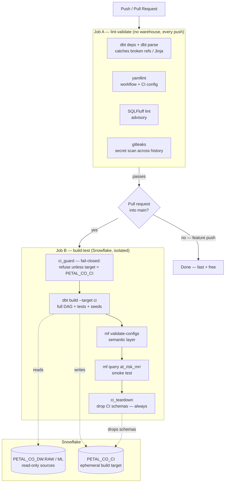

# CI/CD Pipeline — GitHub Actions + dbt + Snowflake

**Schema Works Demo Project 2 — Feature Deep-Dive (P7)**

Every push to `petal-co-demo` is checked automatically before it can reach `main`. A
broken model, a failing test, an unreconciled metric, or a leaked secret is caught in
CI — not in a dashboard, and not in a client's board deck.

---

## Why this exists (the business case)

A data pipeline's product is *trust in a number*. The moment a stakeholder catches one
wrong figure in a report, they stop trusting all of them — and the cost of rebuilding
that trust dwarfs the cost of the bug. CI is cheap insurance against that: a failed test
costs a few seconds and a red check; a wrong number that reaches a decision costs
credibility.

The pipeline is also designed to be **cheap and bounded**. It runs on a dedicated
`XSMALL` warehouse that auto-suspends after 60 seconds and sits behind a 2-credit/month
resource monitor, so CI compute spend is predictable and capped by design rather than by
hope. Fast, free checks run on every push; the warehouse only spins up on pull requests.

---

## Two-stage design

**Job A — `lint-validate`** runs on every push and PR, with no warehouse connection and
no secrets. It runs `dbt deps` + `dbt parse` (which resolves the whole DAG and every
`ref()`/`source()`, catching structural breakage offline), `yamllint`, an advisory
SQLFluff pass, and a `gitleaks` scan across the full git history. If someone ever commits
a key or token, CI goes red before it spreads.

**Job B — `build-test`** runs on pull requests into `main` (and on manual dispatch). It
authenticates to Snowflake with a key-pair, runs the full `dbt build` (models + tests +
seeds), validates the MetricFlow semantic layer, and runs a live metric query as a smoke
test — all inside an isolated database.

---

## The isolation model (the security case)

This is the same "read-only cage" principle behind the P3 governed agent, applied to the
deploy path:

- CI **reads** production sources (`PETAL_CO_DW.RAW`, `PETAL_CO_DW.ML`) but **writes only**
  to a separate database, `PETAL_CO_CI`. Because `sources.yml` hardcodes
  `database: PETAL_CO_DW`, no dbt logic changes were needed to redirect CI's writes — the
  custom `generate_schema_name` macro is untouched.
- The `SCHEMA_WORKS_CI` role has **no write grant anywhere in `PETAL_CO_DW`**. Even if the
  pipeline were compromised, it physically cannot mutate production marts. (Verify:
  `CREATE TABLE PETAL_CO_DW.MARTS.X` under the CI role fails.)
- A fail-closed `ci_guard` macro refuses to run unless `target.database = PETAL_CO_CI` and
  the role is the CI role — so a misconfigured secret can't silently point CI at prod.
- Authentication is **key-pair only** (a dedicated, MFA-exempt service user). The private
  key lives in GitHub Secrets, is written to a file at runtime, and is deleted in an
  `always()` step. The committed `ci/profiles.yml` contains **zero secrets** — only
  `env_var()` references.
- Every CI run **tears its schemas down** (`ci_teardown`, `if: always()`), so no build
  artefacts or synthetic data accumulate.

| Control | Mechanism |
|---|---|
| Blast radius | Separate `PETAL_CO_CI` database; no prod write grant |
| Fail-closed target | `ci_guard` macro (raises before any build/teardown) |
| Secret hygiene | `gitleaks` history scan + secrets-only-in-`env_var` profile |
| Credential type | Key-pair service user, MFA-exempt, key deleted post-run |
| Cost governance | `XSMALL` + 60s auto-suspend + `RM_CI` 2-credit monitor + 900s statement timeout |
| Cleanup | `ci_teardown` drops all CI schemas on every run |

---

## What each check protects

| Check | Catches |
|---|---|
| `dbt parse` | Broken `ref()`/`source()`, bad Jinja, renamed models |
| `dbt build` | SQL that no longer compiles/runs; models that error on real data |
| dbt tests (`not_null`, `assert_positive_revenue`, …) | Data-quality regressions |
| `mf validate-configs` | A semantic model / metric that no longer parses |
| `mf query at_risk_mrr` | The semantic layer can't actually answer a headline metric |
| `gitleaks` | Committed keys, tokens, passwords |

---

## Running it

- **Automatically:** open a pull request into `main`. Job A runs in ~1 minute; Job B
  builds against Snowflake and reports back on the PR.
- **On demand:** the **Actions** tab → **CI** → **Run workflow** (`workflow_dispatch`).
- **Branch protection:** mark `lint-validate` and `build-test` as required status checks
  on `main` so nothing merges red.

See [`CI-CD-Setup-Runbook.md`](./CI-CD-Setup-Runbook.md) for one-time setup (Snowflake
objects, key-pair, GitHub Secrets).

---

## Deliberately out of scope (next steps)

- **Slim CI** (`state:modified+`) to build only changed models against a deferred manifest.
- **CD**: auto-deploy to prod marts on merge to `main`.
- **Source freshness** (`dbt source freshness`) + a scheduled nightly build.
- **dbt docs** generation + hosting (e.g. GitHub Pages).
- Flipping SQLFluff from advisory to a blocking gate once the models are lint-clean.