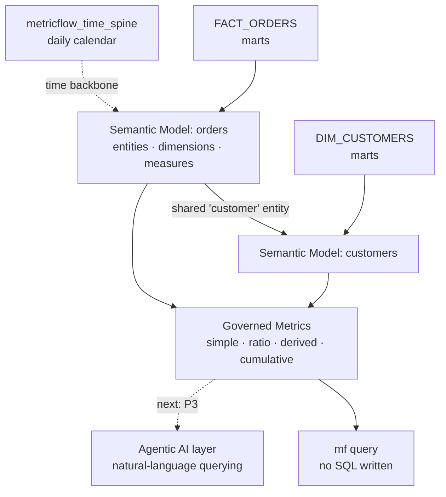

# dbt Semantic Layer (MetricFlow)

## The problem this solves
Ask three people at a D2C brand "what's our AOV?" and you'll often get three
different numbers — because the definition lives inside whatever SQL each
dashboard or analyst happens to write. Metrics drift. Nobody's wrong, but nobody
agrees. This is the problem a semantic layer fixes: **define each metric once,
query it everywhere, get the same answer every time.**

## What's here
A governed semantic layer over the Petal & Co warehouse, built with dbt + MetricFlow.
It sits on top of the existing marts (`FACT_ORDERS`, `DIM_CUSTOMERS`) and exposes
business metrics that any tool — a dashboard, an analyst, or (next) an AI agent —
can query by name, without writing SQL.

## Architecture
Two semantic models, joined automatically on a shared `customer` entity:

| Semantic model | Built on | Grain |
|---|---|---|
| `orders` | `FACT_ORDERS` | one row per order |
| `customers` | `DIM_CUSTOMERS` | one row per customer |

A daily **time spine** (`metricflow_time_spine`) backs all time-based and
cumulative queries.



## Governed metrics
Nine metrics, demonstrating all four MetricFlow types:

| Metric | Type | Definition |
|---|---|---|
| `net_revenue` | simple | Sum of net revenue (after discounts + returns) |
| `gross_revenue` | simple | Sum of gross revenue |
| `total_orders` | simple | Count of orders |
| `total_customers` | simple | Count of customers |
| `mrr` | simple | Net revenue from subscription orders only (subscription-revenue proxy) |
| `aov` | ratio | net_revenue / total_orders |
| `return_rate` | ratio | returned_orders / total_orders |
| `revenue_per_customer` | ratio | net_revenue / total_customers (LTV proxy) |
| `cumulative_net_revenue` | cumulative | All-time running total, shown at month-end |
| `revenue_retention_rate` | derived | (gross − returned) / gross |

## How to query (no SQL)
```bash
# Revenue and AOV by month
mf query --metrics net_revenue,aov --group-by metric_time__month

# Return rate by region
mf query --metrics return_rate --group-by order_record__region

# LTV proxy by region (joins both semantic models automatically)
mf query --metrics revenue_per_customer --group-by customer__region

# All-time running revenue, month-end values, bounded to the data window
mf query --metrics cumulative_net_revenue --group-by metric_time__month \
  --order metric_time__month --start-time 2024-01-01 --end-time 2024-12-31
```

## Why it's the foundation for the AI layer
An LLM pointed at raw warehouse tables invents plausible-but-wrong SQL. Pointed
at this semantic layer, it can only return metrics that are *correctly defined* —
the governed vocabulary is the guardrail that makes natural-language querying
trustworthy. This layer is the query interface the agentic AI work builds on.

## Build notes / gotchas (for anyone replicating)
- A **time spine** model is required before any time-based metric will parse.
- Entity names must avoid SQL reserved words (`order` → `order_record`).
- Ratio metrics reference **metrics**, not measures (build the simple metric first).
- Cumulative metrics rolled up to a coarser grain take the period's *first* value
  by default (looks lagged); use `period_agg: last` for a month-end running total.

*Scope note: built on synthetic data. MRR is modeled as net revenue from
subscription orders (a proxy; true MRR would use a subscription-grain fact).
Churn rate is intentionally deferred to the agentic-AI layer, where predicted
churn is queried from `ML_CHURN_RISK_SCORES` rather than mislabeled as an
actual-churn metric here.*